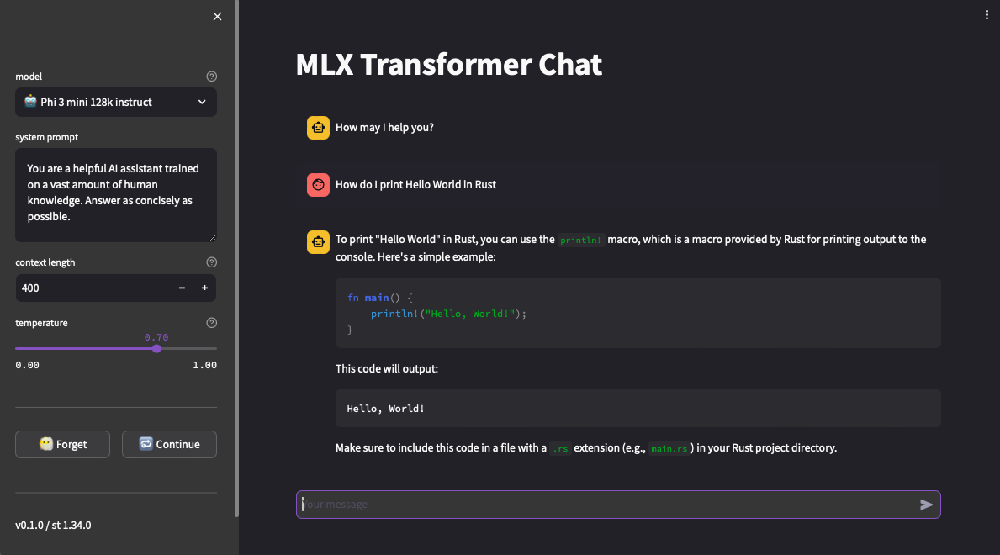

# MLX Transformers

[](https://pypi.org/project/mlx-transformers/)

`mlx-transformers` provides MLX implementations of several Hugging Face-style model architectures for Apple Silicon. The project keeps a familiar Transformers-style API while loading weights from Hugging Face checkpoints and running inference with MLX.

The repository is currently inference-focused. Some model families have broader parity than others, but the core usage pattern is the same across the package:

```python
import mlx.core as mx
from transformers import AutoConfig, AutoTokenizer

from mlx_transformers.models import BertModel

model_name = "sentence-transformers/all-MiniLM-L6-v2"

tokenizer = AutoTokenizer.from_pretrained(model_name)
config = AutoConfig.from_pretrained(model_name)

model = BertModel(config)
model.from_pretrained(model_name)

inputs = tokenizer("Hello from MLX", return_tensors="np")
inputs = {k: mx.array(v) for k, v in inputs.items()}

outputs = model(**inputs)
```

Quantized loading is supported through the same loader:

```python
model.from_pretrained(
    model_name,
    quantize=True,
    group_size=64,
    bits=4,
    mode="affine",
)
```

Pre-quantized MLX checkpoints can also be loaded directly without re-quantizing:

```python
model_name = "mlx-community/Phi-3-mini-4k-instruct-4bit"

config = AutoConfig.from_pretrained(model_name)
model = Phi3ForCausalLM(config)
model.from_pretrained(model_name)
```

## Requirements

- Apple Silicon Mac
- Python 3.10+
- MLX-compatible environment

Some models are gated on Hugging Face. If needed, set `HF_TOKEN` in your environment before calling `from_pretrained(...)`.

## Installation

Install from PyPI:

```bash
pip install mlx-transformers
```

Install for local development:

```bash
pip install -r requirements.txt
pip install -e .
```

`asitop` is also useful if you want to monitor GPU and CPU usage on Apple Silicon:

```bash
pip install asitop
```

## Available Models

Current exports from `src/mlx_transformers/models/__init__.py`:

- BERT
  - `BertModel`
  - `BertForMaskedLM`
  - `BertForSequenceClassification`
  - `BertForTokenClassification`
  - `BertForQuestionAnswering`
- RoBERTa
  - `RobertaModel`
  - `RobertaForSequenceClassification`
  - `RobertaForTokenClassification`
  - `RobertaForQuestionAnswering`
- XLM-RoBERTa
  - `XLMRobertaModel`
  - `XLMRobertaForSequenceClassification`
  - `XLMRobertaForTokenClassification`
  - `XLMRobertaForQuestionAnswering`
- Causal LMs
  - `LlamaModel`, `LlamaForCausalLM`
  - `PhiModel`, `PhiForCausalLM`
  - `Phi3Model`, `Phi3ForCausalLM`
  - `Qwen3Model`, `Qwen3ForCausalLM`
  - `Qwen3VLModel`, `Qwen3VLForConditionalGeneration`
  - `OpenELMModel`, `OpenELMForCausalLM`
  - `PersimmonForCausalLM`
  - `FuyuForCausalLM`
- Translation
  - `M2M100ForConditionalGeneration`

## Examples

### Sentence Embeddings with BERT

```bash
python examples/bert/sentence_transformers.py
```

### LLaMA Text Generation

The LLaMA example now formats the input with the tokenizer chat template and stops on EOS.

```bash
python examples/text_generation/llama_generation.py \
  --model-name meta-llama/Llama-3.2-1B-Instruct \
  --prompt "Write a short explanation of rotary embeddings." \
  --max-tokens 128 \
  --temp 0.0
```

### Quantized LLaMA Text Generation

```bash
python examples/text_generation/quantized_llama_generation.py \
  --model-name meta-llama/Llama-3.2-1B-Instruct \
  --prompt "Explain why 4-bit quantization can reduce memory usage." \
  --bits 4 \
  --group-size 64 \
  --mode affine \
  --max-tokens 128 \
  --temp 0.0
```

### Phi-3 Text Generation

```bash
python examples/text_generation/phi3_generation.py \
  --model-name microsoft/Phi-3-mini-4k-instruct \
  --prompt "Explain attention masking." \
  --max-tokens 128 \
  --temp 0.0
```

### OpenELM Text Generation

```bash
python examples/text_generation/openelm_generation.py \
  --model-name apple/OpenELM-1_1B-Instruct \
  --prompt "Summarize grouped-query attention." \
  --max-tokens 128
```

### Qwen3 Text Generation

```bash
python examples/text_generation/qwen3_generation.py \
  --model-name Qwen/Qwen3-0.6B \
  --prompt "Explain grouped-query attention in one paragraph." \
  --max-tokens 128 \
  --temp 0.0
```

### Qwen3-VL Image + Text Generation

```bash
python examples/text_generation/qwen3_vl_generation.py \
  --model-name Qwen/Qwen3-VL-2B-Instruct \
  --image-url "https://huggingface.co/datasets/huggingface/documentation-images/resolve/main/transformers/tasks/car.jpg" \
  --prompt "Describe the image and mention the likely setting." \
  --max-tokens 128 \
  --temp 0.0
```

### Quantized Qwen3-VL Image + Text Generation

```bash
python examples/text_generation/qwen3_vl_generation.py \
  --model-name Qwen/Qwen3-VL-2B-Instruct \
  --image-path /Users/odunayoogundepo/Desktop/screenshot.png \
  --prompt "What is happening in this image?" \
  --max-tokens 1048 \
  --temp 0.0 \
  --quantize \
  --mode nvfp4 \
  --quantize-input
```

`--quantize-input` is only valid with `--mode nvfp4` or `--mode mxfp8`.

### Gemma3 Image + Text Generation

```bash
python examples/text_generation/gemma3_generation.py \
  --model-name google/gemma-3-4b-it \
  --image-path /Users/odunayoogundepo/Desktop/screenshot.png \
  --prompt "What is happening in this image?" \
  --max-tokens 128 \
  --temp 0.0
```

### Gemma3 Text Generation

```bash
python examples/text_generation/gemma3_text_generation.py \
  --model-name google/gemma-3-4b-it \
  --prompt "Explain grouped-query attention in one paragraph." \
  --max-tokens 128 \
  --temp 0.0
```

### NLLB / M2M-100 Translation

```bash
python examples/translation/nllb_translation.py \
  --model_name facebook/nllb-200-distilled-600M \
  --source_language English \
  --target_language Yoruba \
  --text_to_translate "Let us translate text to Yoruba"
```

## Chat Interface

A Streamlit chat UI is included under `chat/`.

```bash
cd chat
bash start.sh
```

Add or remove entries in `chat/models.txt` to control which models appear in the
sidebar. The chat app now resolves supported text model families from the model
config, including `phi`, `phi3`, `llama`, `qwen3`, `openelm`, `persimmon`, and
`gemma3_text`.



## Tests

The repository currently includes focused tests for:

- BERT
- RoBERTa
- XLM-RoBERTa
- LLaMA
- Phi
- Phi-3

Run the full test suite:

```bash
python -m unittest
```

Run a single module:

```bash
python -m unittest tests.test_bert
python -m unittest tests.test_llama
```

Some tests download model weights from Hugging Face on first run.

## Repository Layout

```text
src/mlx_transformers/models/   model implementations and shared helpers
examples/                      runnable examples
tests/                         model parity and behavior tests
chat/                          streamlit chat interface
```

## Notes

- Model loading is handled through `from_pretrained(...)` in `src/mlx_transformers/models/base.py`.
- Pretrained models are loaded in eval mode by default.
- Causal generation support is present for the decoder-style model families, but parity and feature coverage still vary by architecture.

## Contributing

Contributions are welcome. The highest-value contributions are usually:

- new model implementations
- parity fixes against Hugging Face behavior
- generation and cache correctness fixes
- tests for unsupported or weakly covered paths
